# 16. 核心业务流程

本文档描述 Enterprise Agent Hub 的核心业务流程。

流程覆盖三类扩展：

1. **Skill**：文件型能力包，以 `SKILL.md` 为入口。
2. **MCP Server**：通过 Model Context Protocol 接入工具或 Agent 的扩展。
3. **Plugin**：面向指定 AI 工具、内部工具或 Agent 环境的插件型扩展。

## 16.0 流程总览与通用规则

### 业务主链路

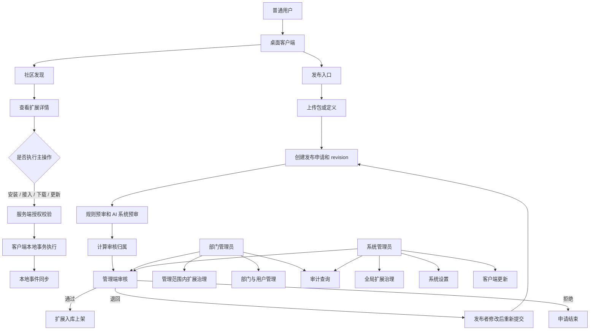
```mermaid
flowchart TD
    A[普通用户] --> B[桌面客户端]
    B --> C[社区发现]
    C --> D[查看扩展详情]
    D --> E{是否执行主操作}
    E -->|安装 / 接入 / 下载 / 更新| F[服务端授权校验]
    F --> G[客户端本地事务执行]
    G --> H[本地事件同步]

    B --> I[发布入口]
    I --> J[上传包或定义]
    J --> K[创建发布申请和 revision]
    K --> L[规则预审和 AI 系统预审]
    L --> M[计算审核归属]
    M --> N[管理端审核]
    N -->|通过| O[扩展入库上架]
    N -->|退回| P[发布者修改后重新提交]
    N -->|拒绝| Q[申请结束]
    P --> K

    R[部门管理员] --> N
    R --> S[管理范围内扩展治理]
    R --> T[部门与用户管理]
    R --> U[审计查询]

    V[系统管理员] --> N
    V --> W[全局扩展治理]
    V --> X[系统设置]
    V --> Y[客户端更新]
    V --> U
```

### 通用规则

1. 服务端是扩展、版本、权限、可见选项、审核、统计和审计的权威来源。
2. 桌面客户端负责本机执行、缓存、回滚和离线事件记录，不作为权限最终判断来源。
3. 授权范围控制主操作，可见选项控制社区展示，两者不得混用。
4. 主操作包括安装、下载、复制配置、新增启用、配置写入、连接检测、更新等需要服务端授权的动作。
5. 停用、卸载、移除托管配置、清理本地敏感变量、清除 manual-download 本地记录属于本机清理动作，不因后续授权收缩、普通下架或归属部门停用而被禁止。
6. AI 系统预审只辅助管理员识别风险，不得自动通过或自动拒绝申请。
7. 发布、预审、审核、下载凭证、扩展治理、权限拒绝、本地异常上报、客户端更新等关键动作必须可审计。
8. 审计日志、通知、运行日志、本地事件和客户端设备事件必须能通过 requestID、deviceID 或业务对象 ID 关联排查。
9. 密码、Token、API Key、下载凭证明文、真实密钥、用户填写的 MCP 敏感变量值不得进入审计日志或普通运行日志。
10. 失败必须明确返回错误或部分成功状态，不得用默认成功、空对象或假结果掩盖真实失败。

---

## 16.1 登录与设备登记流程

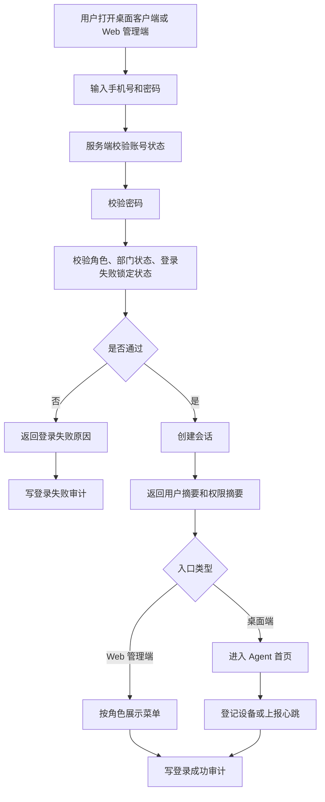
```mermaid
flowchart TD
    A[用户打开桌面客户端或 Web 管理端] --> B[输入手机号和密码]
    B --> C[服务端校验账号状态]
    C --> D[校验密码]
    D --> E[校验角色、部门状态、登录失败锁定状态]
    E --> F{是否通过}
    F -->|否| G[返回登录失败原因]
    G --> H[写登录失败审计]
    F -->|是| I[创建会话]
    I --> J[返回用户摘要和权限摘要]
    J --> K{入口类型}
    K -->|桌面端| L[进入 Agent 首页]
    K -->|Web 管理端| M[按角色展示菜单]
    L --> N[登记设备或上报心跳]
    M --> O[写登录成功审计]
    N --> O
```

1. 用户打开桌面客户端或 Web 管理端。
2. 用户输入手机号和密码。
3. 服务端校验账号状态、密码、角色、所属部门状态和登录失败锁定状态。
4. 登录失败时返回明确错误，写登录失败审计，并按登录失败策略限频或锁定。
5. 登录成功后返回会话、用户摘要和权限摘要。
6. 桌面客户端进入 Agent 首页；Agent 具体能力由独立 Agent 设计文档承接。
7. Web 管理端根据角色展示可访问菜单。
8. 桌面客户端登录成功后登记设备或上报设备心跳、客户端版本、OS 和架构。
9. 用户被冻结、删除、部门停用、角色变化、部门变化、密码重置或主动修改密码后，已有会话必须失效。

---

## 16.2 社区发现、搜索、详情与 Star 流程

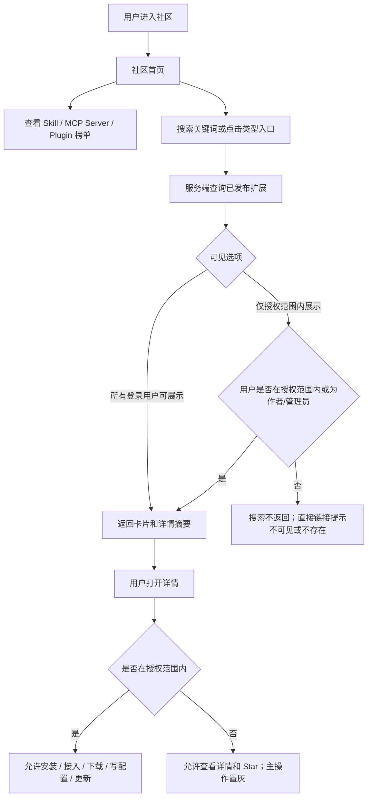
```mermaid
flowchart TD
    A[用户进入社区] --> B[社区首页]
    B --> C[查看 Skill / MCP Server / Plugin 榜单]
    B --> D[搜索关键词或点击类型入口]
    D --> E[服务端查询已发布扩展]
    E --> F{可见选项}
    F -->|所有登录用户可展示| G[返回卡片和详情摘要]
    F -->|仅授权范围内展示| H{用户是否在授权范围内或为作者/管理员}
    H -->|是| G
    H -->|否| I[搜索不返回；直接链接提示不可见或不存在]
    G --> J[用户打开详情]
    J --> K{是否在授权范围内}
    K -->|是| L[允许安装 / 接入 / 下载 / 写配置 / 更新]
    K -->|否| M[允许查看详情和 Star；主操作置灰]
```

1. 用户点击桌面客户端 `社区`。
2. 系统进入社区首页，展示搜索区、发布按钮、Skill/MCP Server/Plugin 三类榜单和类型入口。
3. 榜单只统计未勾选“仅授权范围内展示”的已发布扩展。
4. 用户提交搜索或点击类型入口。
5. 服务端按扩展状态、归属部门状态和可见选项过滤结果。
6. 搜索结果按类型分组或单类型展示，不得将 Skill、MCP Server、Plugin 直接混排。
7. 用户点击卡片打开详情。
8. 用户可对可见扩展执行 Star 或取消 Star。
9. 若用户不在授权范围内但扩展可见，详情内容仍可查看，Star 可用，但安装、接入、复制配置、下载、配置写入、连接检测、更新等主操作不可用。
10. 若扩展勾选“仅授权范围内展示”且用户不在授权范围内，搜索和详情均不可见，不暴露扩展名称、作者、部门、描述和详情。
11. Star、搜索、榜单点击属于普通行为或统计事件；权限拒绝、不可见访问拒绝必须写审计日志。

---

## 16.3 Extension 生命周期状态流程

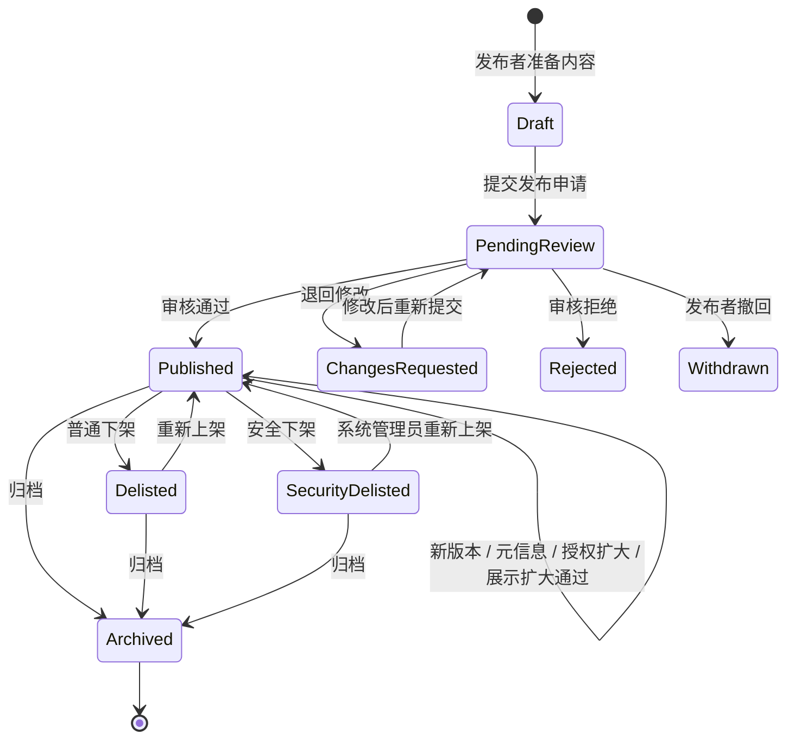
```mermaid
stateDiagram-v2
    [*] --> Draft: 发布者准备内容
    Draft --> PendingReview: 提交发布申请
    PendingReview --> Published: 审核通过
    PendingReview --> ChangesRequested: 退回修改
    ChangesRequested --> PendingReview: 修改后重新提交
    PendingReview --> Rejected: 审核拒绝
    PendingReview --> Withdrawn: 发布者撤回

    Published --> Published: 新版本 / 元信息 / 授权扩大 / 展示扩大通过
    Published --> Delisted: 普通下架
    Published --> SecurityDelisted: 安全下架
    Published --> Archived: 归档

    Delisted --> Published: 重新上架
    Delisted --> Archived: 归档
    SecurityDelisted --> Published: 系统管理员重新上架
    SecurityDelisted --> Archived: 归档
    Archived --> [*]
```

1. 发布申请对发布者展示为：待审核、需修改、已拒绝、已通过、已撤回。
2. 服务端内部可使用 created、validating、ai_prechecking、pending_review、in_review、changes_requested、rejected、approved、withdrawn 等状态。
3. Extension 对社区和管理端展示为：已发布、已下架、已安全下架、已归档。
4. 同一 Extension 只有一个当前发布版本，历史版本保留用于审计和展示，不允许普通用户选择安装旧版本。
5. 新版本审核期间，旧版本继续可用。
6. 已归档是终态，不得重新上架、不得发布新版本、不得变更授权范围或可见选项。

---

## 16.4 发布内容准备与临时上传流程

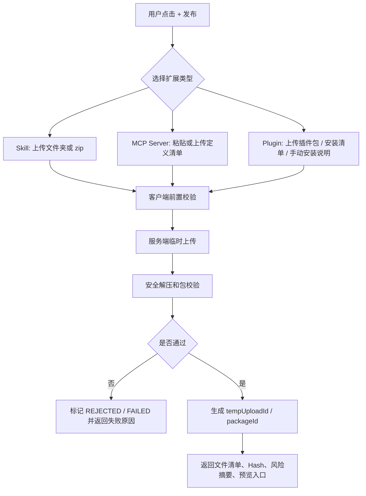
```mermaid
flowchart TD
    A[用户点击 + 发布] --> B{选择扩展类型}
    B --> C[Skill: 上传文件夹或 zip]
    B --> D[MCP Server: 粘贴或上传定义清单]
    B --> E[Plugin: 上传插件包 / 安装清单 / 手动安装说明]
    C --> F[客户端前置校验]
    D --> F
    E --> F
    F --> G[服务端临时上传]
    G --> H[安全解压和包校验]
    H --> I{是否通过}
    I -->|否| J[标记 REJECTED / FAILED 并返回失败原因]
    I -->|是| K[生成 tempUploadId / packageId]
    K --> L[返回文件清单、Hash、风险摘要、预览入口]
```

1. 发布向导第一步必须选择扩展类型。
2. Skill 支持文件夹上传或 zip 上传，根目录必须包含 `SKILL.md`。
3. MCP Server 支持粘贴 MCP 定义清单、上传定义文件或填写连接信息和配置模板。
4. Plugin 支持上传插件包、上传或填写安装清单、填写手动安装说明、填写企业内网受控下载信息。
5. 客户端前置校验必填字段、Extension ID、版本号、分类、标签、授权范围、可见选项、包大小、文件数量和类型特定字段。
6. 服务端临时上传后执行最终校验，包括路径穿越、绝对路径、Windows 盘符路径、软链接逃逸、压缩炸弹、文件数量、文件大小、Hash、敏感信息和高风险文件识别。
7. 校验失败时，服务端标记临时上传失败或拒绝，并返回明确错误，不得生成可提交的临时上传引用。
8. 校验通过后，服务端保存临时上传记录、文件清单、预览内容、风险摘要和 SHA-256，返回 tempUploadId。
9. 临时上传有有效期，只能被创建人消费，一次发布申请只能引用一个有效临时上传。
10. 临时上传被发布申请消费后状态变为已消费，不允许重复提交或跨用户复用。

---

## 16.5 发布申请、系统预审与审核归属流程

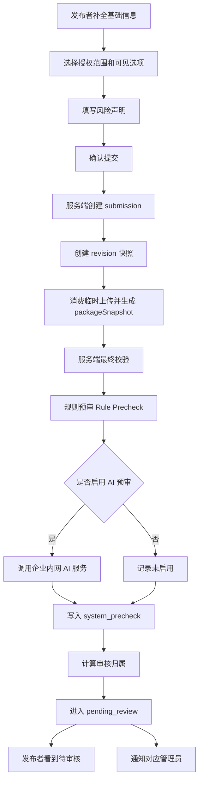
```mermaid
flowchart TD
    A[发布者补全基础信息] --> B[选择授权范围和可见选项]
    B --> C[填写风险声明]
    C --> D[确认提交]
    D --> E[服务端创建 submission]
    E --> F[创建 revision 快照]
    F --> G[消费临时上传并生成 packageSnapshot]
    G --> H[服务端最终校验]
    H --> I[规则预审 Rule Precheck]
    I --> J{是否启用 AI 预审}
    J -->|是| K[调用企业内网 AI 服务]
    J -->|否| L[记录未启用]
    K --> M[写入 system_precheck]
    L --> M
    M --> N[计算审核归属]
    N --> O[进入 pending_review]
    O --> P[发布者看到待审核]
    O --> Q[通知对应管理员]
```

1. 用户在社区点击 `+ 发布`，选择类型并提供内容。
2. 系统自动识别包、配置或安装说明中的可提取字段，用户补全基础信息。
3. 用户选择授权范围和可见选项，并填写风险声明。
4. 用户确认提交后，服务端创建发布申请，保存 submission 和第一个 revision 快照。
5. 服务端消费临时上传，生成 packageSnapshot，并把包从临时存储移动到正式待审存储位置。
6. 服务端执行最终校验和规则预审，结果写入当前 revision 的 system_precheck。
7. 若启用 AI 系统预审，服务端调用企业内网 AI 服务，使用脱敏输入生成风险摘要和建议检查项，并写入 system_precheck。
8. AI 系统预审不可用时，按系统设置继续进入人工审核或标记“AI 预审不可用”。
9. 系统根据授权范围、可见选项、提交人部门和管理员管理范围计算审核归属。
10. 部门范围申请由对应部门管理员处理；跨部门、全员、展示扩大到管理范围外、安全风险重新上架等由系统管理员或具备范围权限的管理员处理。
11. 发布者看到状态“待审核”。
12. 管理员收到待审核通知。
13. 提交动作、规则预审和 AI 预审完成、失败或不可用都必须写审计日志。

---

## 16.6 管理端审核与入库生效流程

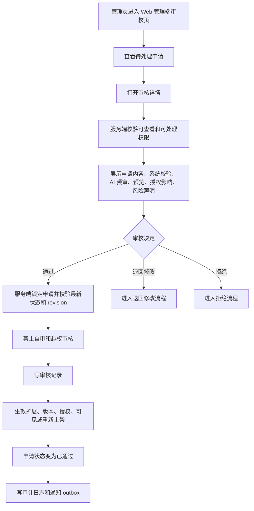
```mermaid
flowchart TD
    A[管理员进入 Web 管理端审核页] --> B[查看待处理申请]
    B --> C[打开审核详情]
    C --> D[服务端校验可查看和可处理权限]
    D --> E[展示申请内容、系统校验、AI 预审、预览、授权影响、风险声明]
    E --> F{审核决定}
    F -->|通过| G[服务端锁定申请并校验最新状态和 revision]
    G --> H[禁止自审和越权审核]
    H --> I[写审核记录]
    I --> J[生效扩展、版本、授权、可见或重新上架]
    J --> K[申请状态变为已通过]
    K --> L[写审计日志和通知 outbox]
    F -->|退回修改| M[进入退回修改流程]
    F -->|拒绝| N[进入拒绝流程]
```

1. 管理员登录 Web 管理端并进入审核页。
2. 审核列表展示待处理、处理中、已处理申请。
3. 管理员打开审核详情，服务端在打开详情时校验管理员权限。
4. 审核详情展示申请内容、系统校验结果、AI 系统预审结果、文件或配置预览、授权影响、可见选项、风险说明和历史记录。
5. 管理员选择通过、退回修改或拒绝。
6. 管理员提交决定时，服务端再次校验管理员权限、申请最新状态和当前 revision。
7. 申请提交人不得审核自己的申请。
8. 如果申请已被他人处理或 revision 已变化，当前操作失败并提示最新状态。
9. 审核通过必须在同一事务中完成：写审核记录、生效业务变更、更新申请状态、写审计日志、写通知 outbox。
10. 首次发布通过后，服务端创建 Extension、当前 Version、授权范围、包引用；MCP Server 同步落库 MCP 定义；Plugin 同步落库插件定义。
11. 发布新版本通过后，服务端发布新版本、切换当前版本，并保留历史版本。
12. 元信息修改通过后，服务端更新名称、描述、分类、标签等元数据。
13. 授权扩大通过后，服务端写入新的授权范围。
14. 展示扩大通过后，服务端更新可见选项。
15. 重新上架申请通过后，扩展状态恢复为已发布。
16. 审核完成后发布者收到通知。

---

## 16.7 退回修改、重新提交、拒绝与撤回流程

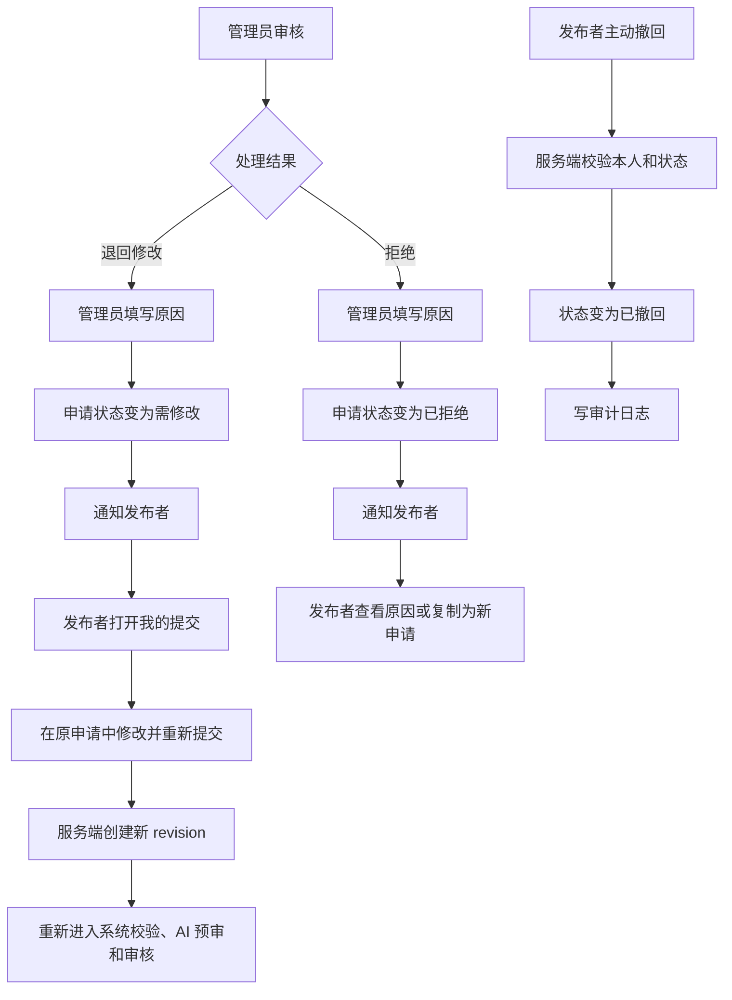
```mermaid
flowchart TD
    A[管理员审核] --> B{处理结果}
    B -->|退回修改| C[管理员填写原因]
    C --> D[申请状态变为需修改]
    D --> E[通知发布者]
    E --> F[发布者打开我的提交]
    F --> G[在原申请中修改并重新提交]
    G --> H[服务端创建新 revision]
    H --> I[重新进入系统校验、AI 预审和审核]

    B -->|拒绝| J[管理员填写原因]
    J --> K[申请状态变为已拒绝]
    K --> L[通知发布者]
    L --> M[发布者查看原因或复制为新申请]

    N[发布者主动撤回] --> O[服务端校验本人和状态]
    O --> P[状态变为已撤回]
    P --> Q[写审计日志]
```

1. 管理员退回修改时必须填写原因，可选择原因模板。
2. 申请状态变为需修改，发布者收到通知。
3. 发布者打开“我的提交”，在原申请中修改内容并重新提交。
4. 服务端创建新的 submission revision，保留原 revision、退回意见和历史校验结果。
5. 新 revision 重新进入系统校验、AI 预审和管理员审核流程。
6. 最终通过时记录生效 revision。
7. 管理员拒绝时必须填写原因，本次申请结束。
8. 已拒绝申请不能直接继续审核，发布者可查看原因或复制为新申请。
9. 发布者可撤回自己尚未处理完成的申请。
10. 已通过、已拒绝、已撤回等终态申请不可撤回。

---

## 16.8 Skill 安装流程

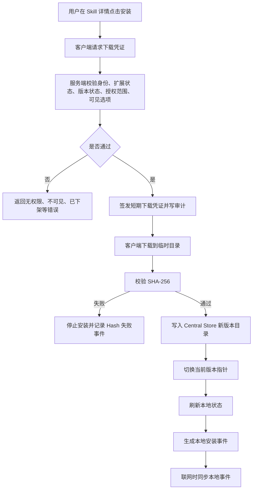
```mermaid
flowchart TD
    A[用户在 Skill 详情点击安装] --> B[客户端请求下载凭证]
    B --> C[服务端校验身份、扩展状态、版本状态、授权范围、可见选项]
    C --> D{是否通过}
    D -->|否| E[返回无权限、不可见、已下架等错误]
    D -->|是| F[签发短期下载凭证并写审计]
    F --> G[客户端下载到临时目录]
    G --> H[校验 SHA-256]
    H -->|失败| I[停止安装并记录 Hash 失败事件]
    H -->|通过| J[写入 Central Store 新版本目录]
    J --> K[切换当前版本指针]
    K --> L[刷新本地状态]
    L --> M[生成本地安装事件]
    M --> N[联网时同步本地事件]
```

1. 用户在 Skill 详情点击安装。
2. 客户端请求服务端下载凭证。
3. 服务端校验用户身份、用户状态、部门状态、扩展状态、版本状态、授权范围和可见选项。
4. 服务端发放短期下载凭证，并记录下载凭证发放审计。
5. 客户端下载包到临时目录。
6. 客户端校验 SHA-256。
7. Hash 校验失败时不得覆盖旧版本或写入 Central Store。
8. Hash 校验通过后写入 Central Store 的新版本目录。
9. 客户端切换当前版本指针。
10. 客户端刷新本地状态。
11. 客户端生成本地安装事件。
12. 联网时同步本地事件，服务端按幂等键去重并更新统计。

---

## 16.9 Skill 启用、停用、更新与卸载流程

### Skill 启用流程

1. 用户在 Skill 详情或本地页点击启用范围。
2. 客户端展示可用工具和项目。
3. 用户选择目标工具或项目。
4. 在线新增启用目标时，客户端应刷新服务端授权状态或调用轻量授权校验。
5. 离线启用仅允许在本机已有有效授权缓存且未收到授权收缩或安全下架标记时执行。
6. 客户端校验目标路径是否存在、是否可写、是否存在冲突文件。
7. 客户端生成启用执行计划。
8. 客户端执行格式转换。
9. 客户端优先 symlink 到目标路径。
10. symlink 失败时降级 copy，并记录降级原因。
11. 若部分目标失败，客户端按执行计划回滚可回滚目标。
12. 客户端刷新本地状态并记录启用、降级、失败、回滚或部分成功事件。
13. 联网时同步本地事件。

### Skill 停用流程

1. 用户在本地页或启用范围弹窗点击停用。
2. 客户端展示当前启用目标。
3. 用户确认停用。
4. 客户端生成停用执行计划。
5. 客户端移除目标位置的 Hub 托管启用内容。
6. 若移除失败，展示失败位置和原因。
7. 客户端记录停用、失败或部分成功事件。
8. 停用不因授权收缩、普通下架或归属部门停用而被禁止。

### Skill 更新流程

1. 客户端发现服务端有新版本。
2. 本地页或详情页展示有更新。
3. 用户点击更新。
4. 服务端校验用户仍具备更新权限。
5. 客户端获取下载凭证。
6. 客户端下载新包到临时目录并校验 Hash。
7. Hash 通过后写入 Central Store 新版本目录。
8. 客户端备份当前版本指针和已启用目标元数据。
9. 客户端切换当前版本指针。
10. 客户端重新分发到已启用目标。
11. 若本地内容已变更，更新前提示覆盖风险。
12. 若分发失败，客户端回滚可回滚目标，并展示部分成功或失败原因。
13. 客户端记录更新事件。
14. 若服务端返回授权收缩、已下架、已安全下架或已归档，客户端不得继续更新，并刷新本地状态提示。

### Skill 卸载流程

1. 用户点击卸载。
2. 客户端展示当前启用位置和 Central Store 副本。
3. 用户确认。
4. 客户端生成卸载执行计划。
5. 客户端移除目标位置的托管启用内容。
6. 客户端删除 Central Store 副本。
7. 若部分目标失败，显示部分成功并列出失败位置。
8. 客户端记录卸载事件。
9. 卸载后若服务端权限已收缩、扩展已下架、扩展已归档或归属部门已停用，用户不得重新安装、重新下载或重新启用该扩展。

---

## 16.10 MCP Server 安装接入、更新与卸载流程

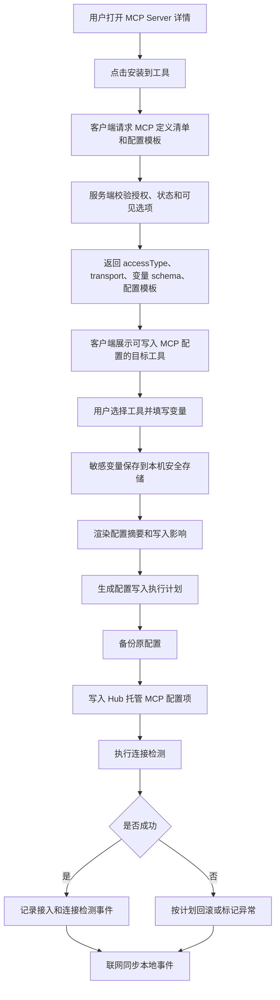
```mermaid
flowchart TD
    A[用户打开 MCP Server 详情] --> B[点击安装到工具]
    B --> C[客户端请求 MCP 定义清单和配置模板]
    C --> D[服务端校验授权、状态和可见选项]
    D --> E[返回 accessType、transport、变量 schema、配置模板]
    E --> F[客户端展示可写入 MCP 配置的目标工具]
    F --> G[用户选择工具并填写变量]
    G --> H[敏感变量保存到本机安全存储]
    H --> I[渲染配置摘要和写入影响]
    I --> J[生成配置写入执行计划]
    J --> K[备份原配置]
    K --> L[写入 Hub 托管 MCP 配置项]
    L --> M[执行连接检测]
    M --> N{是否成功}
    N -->|是| O[记录接入和连接检测事件]
    N -->|否| P[按计划回滚或标记异常]
    O --> Q[联网同步本地事件]
    P --> Q
```

### 安装接入

1. 用户在社区搜索或榜单中打开 MCP Server 详情。
2. 服务端返回详情、授权标记和可见标记。
3. 用户点击 `安装到工具`。
4. 客户端请求 MCP 定义清单和配置模板。
5. 服务端校验用户身份、扩展状态、版本状态、授权范围和可见选项。
6. 客户端展示可写入 MCP 配置的目标工具。
7. 用户选择目标工具。
8. 客户端检测目标工具配置路径和写入能力。
9. 用户填写变量；敏感变量只保存在本机安全存储。
10. 客户端渲染配置摘要，展示写入影响。
11. 客户端生成配置写入执行计划。
12. 用户确认。
13. 客户端备份原配置。
14. 客户端写入 Enterprise Agent Hub 托管的 MCP 配置项。
15. 客户端执行连接检测。
16. 写入或检测失败时，客户端按计划回滚可回滚目标，或按执行计划保留配置并标记异常。
17. 客户端记录 MCP 接入事件、连接检测事件和异常事件。
18. 联网时同步本地事件。

### 更新

1. 客户端发现 MCP Server 有新版本。
2. 本地页展示有更新。
3. 用户点击更新配置。
4. 服务端校验用户仍具备更新权限。
5. 客户端获取新配置模板和变更摘要。
6. 客户端保留用户本机变量值和 SecretRef。
7. 若新增必填变量，客户端要求用户补充。
8. 客户端生成配置更新执行计划。
9. 客户端备份旧配置并写入新配置。
10. 客户端执行连接检测。
11. 失败时按计划回滚。
12. 客户端记录更新事件。
13. 被删除变量对应的旧 SecretRef 可标记为待清理，不应在更新失败时直接删除。

### 卸载

1. 用户点击卸载配置。
2. 客户端展示已写入的目标工具和托管配置项。
3. 用户确认。
4. 客户端生成卸载执行计划。
5. 客户端备份当前配置。
6. 客户端仅移除 Enterprise Agent Hub 托管的 MCP 配置项。
7. 客户端不删除发布者部署的远端服务，也不删除用户手动创建的配置。
8. 客户端可清理相关本机 SecretRef。
9. 客户端记录卸载事件。
10. 卸载不因授权收缩、普通下架或归属部门停用而被禁止。

---

## 16.11 Plugin 使用、更新与卸载流程

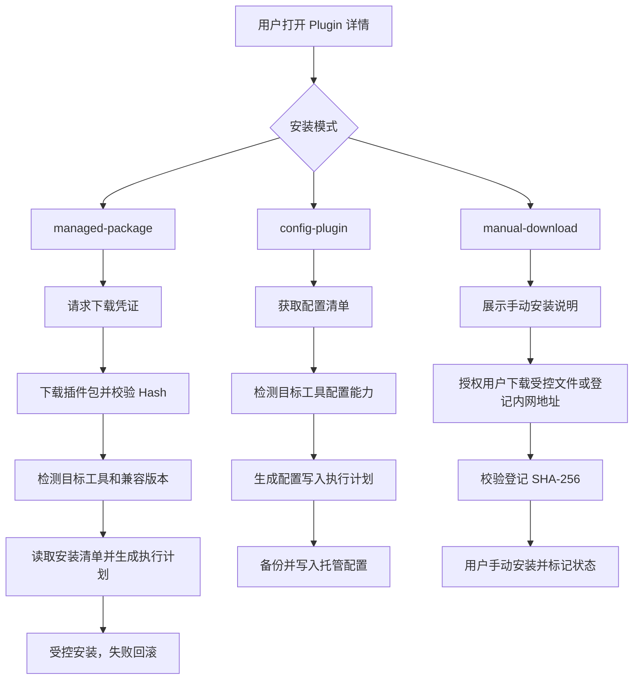
```mermaid
flowchart TD
    A[用户打开 Plugin 详情] --> B{安装模式}
    B --> C[managed-package]
    C --> C1[请求下载凭证]
    C1 --> C2[下载插件包并校验 Hash]
    C2 --> C3[检测目标工具和兼容版本]
    C3 --> C4[读取安装清单并生成执行计划]
    C4 --> C5[受控安装，失败回滚]

    B --> D[config-plugin]
    D --> D1[获取配置清单]
    D1 --> D2[检测目标工具配置能力]
    D2 --> D3[生成配置写入执行计划]
    D3 --> D4[备份并写入托管配置]

    B --> E[manual-download]
    E --> E1[展示手动安装说明]
    E1 --> E2[授权用户下载受控文件或登记内网地址]
    E2 --> E3[校验登记 SHA-256]
    E3 --> E4[用户手动安装并标记状态]
```

### managed-package

1. 用户打开 Plugin 详情。
2. 用户点击安装。
3. 服务端校验身份、扩展状态、版本状态、授权范围和可见选项。
4. 服务端发放下载凭证。
5. 客户端下载插件包并校验 Hash。
6. 客户端检测目标工具和兼容版本。
7. 客户端读取安装清单并生成执行计划。
8. 用户确认。
9. 客户端安装到受控位置或目标工具位置。
10. 失败时按计划回滚。
11. 客户端记录安装事件。

### config-plugin

1. 用户打开 Plugin 详情。
2. 用户点击安装。
3. 服务端校验身份、扩展状态、版本状态、授权范围和可见选项。
4. 客户端获取配置清单。
5. 客户端检测目标工具配置能力。
6. 客户端根据配置清单生成写入执行计划。
7. 用户确认。
8. 客户端备份原配置并写入托管配置项。
9. 失败时按计划回滚。
10. 客户端记录安装或启用事件。

### manual-download

1. 用户打开 Plugin 详情。
2. 用户查看安装说明和卸载说明。
3. 若用户在授权范围内，可请求下载凭证并下载 Hub 托管文件。
4. 若使用企业内部下载地址，客户端记录下载来源并校验登记的 SHA-256。
5. 用户按说明手动安装。
6. 用户可在本地页标记已安装或已卸载。
7. 客户端记录受控下载和本地标记事件。
8. 标记已安装只代表用户本地记录，不得伪装成系统已完成真实自动安装。

### 更新

1. 客户端发现 Plugin 有新版本。
2. 本地页展示有更新。
3. 用户点击更新。
4. 服务端校验用户仍具备更新权限。
5. 客户端按安装模式获取新包或新配置清单。
6. 客户端生成更新执行计划。
7. 用户确认后执行。
8. 失败时尽量回滚并展示原因。
9. 客户端记录更新事件。

### 卸载

1. 用户点击卸载。
2. 客户端展示已安装位置、托管配置或手动安装说明。
3. managed-package 和 config-plugin 按安装清单卸载托管内容。
4. manual-download 只清除本地状态记录，并提示用户按说明手动卸载。
5. 客户端记录卸载事件。
6. 卸载不因授权收缩、普通下架或归属部门停用而被禁止。

---

## 16.12 受控下载与下载凭证流程

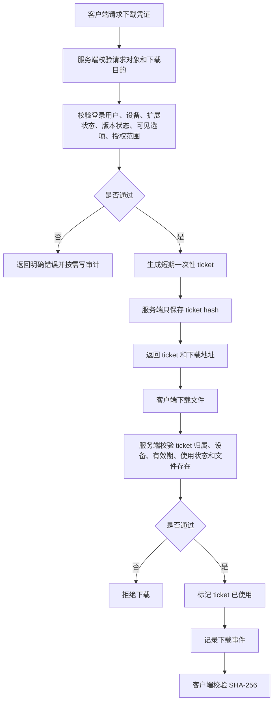
```mermaid
flowchart TD
    A[客户端请求下载凭证] --> B[服务端校验请求对象和下载目的]
    B --> C[校验登录用户、设备、扩展状态、版本状态、可见选项、授权范围]
    C --> D{是否通过}
    D -->|否| E[返回明确错误并按需写审计]
    D -->|是| F[生成短期一次性 ticket]
    F --> G[服务端只保存 ticket hash]
    G --> H[返回 ticket 和下载地址]
    H --> I[客户端下载文件]
    I --> J[服务端校验 ticket 归属、设备、有效期、使用状态和文件存在]
    J --> K{是否通过}
    K -->|否| L[拒绝下载]
    K -->|是| M[标记 ticket 已使用]
    M --> N[记录下载事件]
    N --> O[客户端校验 SHA-256]
```

1. 下载凭证适用于 Skill 安装/更新、Plugin managed-package 安装/更新、Plugin manual-download 受控下载、审核预览下载、客户端更新包下载。
2. 客户端请求下载凭证时必须明确对象类型和下载目的。
3. 服务端校验用户身份、对象类型、下载目的、扩展状态、版本状态、授权范围、可见选项和设备绑定关系。
4. 审核预览下载只允许具备审核或管理权限的管理员申请。
5. 客户端更新包下载必须校验设备登记关系、客户端版本策略和更新版本状态。
6. 下载凭证为短期、一次性使用，服务端只保存凭证 hash，不记录明文。
7. 使用下载凭证下载时，服务端再次校验凭证有效期、使用状态、用户归属、设备绑定、扩展状态和文件存在性。
8. 下载成功后服务端标记凭证已使用，并记录下载事件。
9. 客户端下载后必须校验 SHA-256。
10. Hash 校验失败不得继续安装或覆盖旧内容，必须记录本地失败事件并在联网时同步。

---

## 16.13 本地执行事务与回滚流程

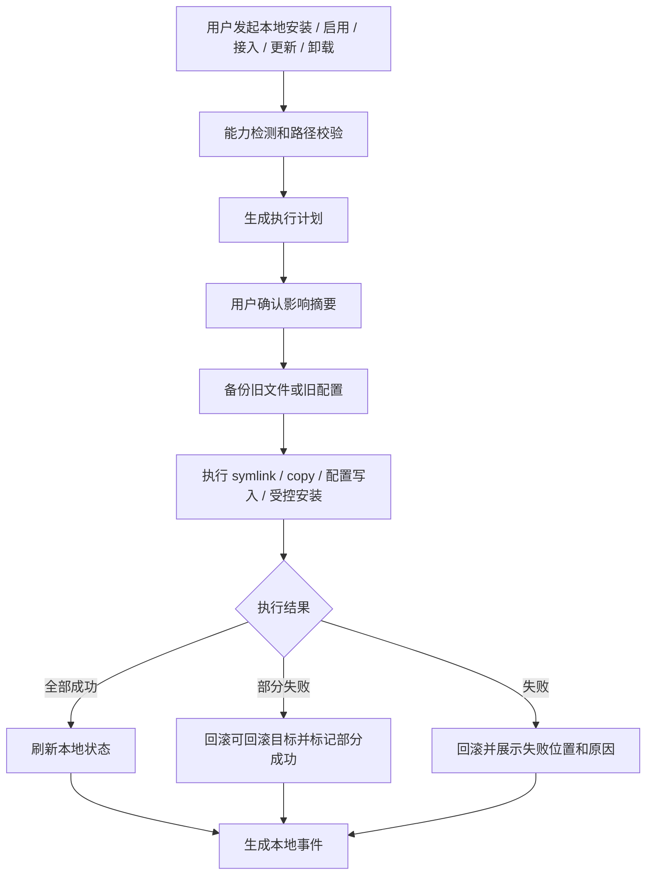
```mermaid
flowchart TD
    A[用户发起本地安装 / 启用 / 接入 / 更新 / 卸载] --> B[能力检测和路径校验]
    B --> C[生成执行计划]
    C --> D[用户确认影响摘要]
    D --> E[备份旧文件或旧配置]
    E --> F[执行 symlink / copy / 配置写入 / 受控安装]
    F --> G{执行结果}
    G -->|全部成功| H[刷新本地状态]
    G -->|部分失败| I[回滚可回滚目标并标记部分成功]
    G -->|失败| J[回滚并展示失败位置和原因]
    H --> K[生成本地事件]
    I --> K
    J --> K
```

1. 客户端在启用、接入、安装、停用、更新、卸载前必须生成执行计划。
2. 执行计划必须包含将要新增、移除、覆盖、修改、跳过的目标，以及每个目标使用 symlink、copy、配置写入还是受控下载。
3. 用户确认危险操作时，只展示影响摘要，不展示低层文件细节。
4. 下载包先写入临时目录，Hash 校验通过后再进入 Central Store 或插件受控目录。
5. Central Store 更新使用新版本目录，成功后再切换当前版本指针。
6. 向工具或项目分发时先写临时目标，成功后再替换正式目标。
7. 写入配置文件时先读取、校验、备份，再写入临时文件，最后替换正式文件。
8. 不得在 Hash 未通过时覆盖旧版本。
9. 覆盖目标前必须备份旧目标的元数据和必要文件。
10. 修改配置文件前必须保存配置快照。
11. 部分目标失败时，已成功目标不强行全部撤销；客户端展示“部分成功”。
12. 对已经覆盖但后续失败的目标，若备份完整且路径仍可写，应自动回滚。
13. 无法自动回滚时，必须列出失败路径、原因和建议动作。
14. 回滚、部分成功、降级 copy、权限失败和路径异常都必须生成本地事件。

---

## 16.14 离线行为与本地事件同步流程

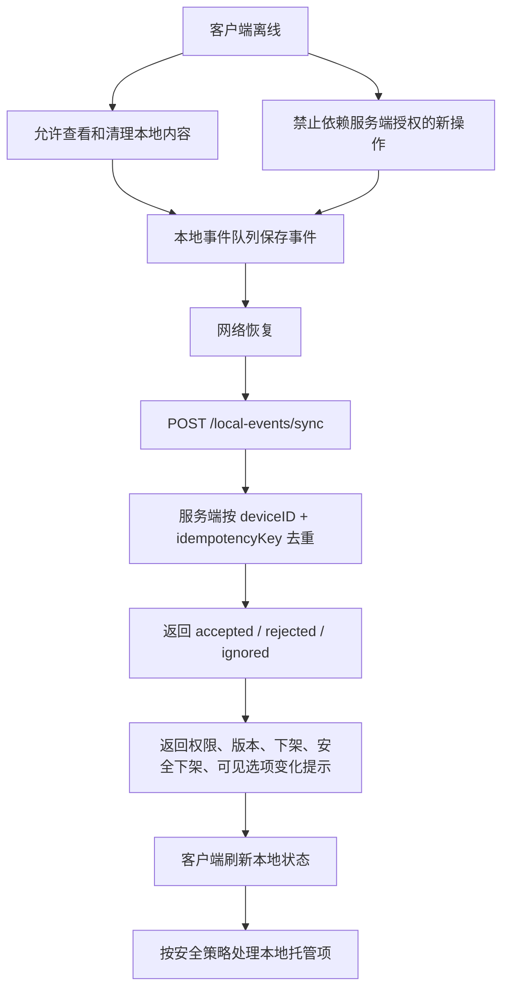
```mermaid
flowchart TD
    A[客户端离线] --> B[允许查看和清理本地内容]
    A --> C[禁止依赖服务端授权的新操作]
    B --> D[本地事件队列保存事件]
    C --> D
    D --> E[网络恢复]
    E --> F[POST /local-events/sync]
    F --> G[服务端按 deviceID + idempotencyKey 去重]
    G --> H[返回 accepted / rejected / ignored]
    H --> I[返回权限、版本、下架、安全下架、可见选项变化提示]
    I --> J[客户端刷新本地状态]
    J --> K[按安全策略处理本地托管项]
```

1. 离线期间允许查看已缓存本地扩展。
2. 若本机已有有效授权缓存且未收到授权收缩或安全下架标记，可启用已安装 Skill。
3. 离线期间始终允许停用已安装 Skill、停用已接入 MCP Server、禁用或卸载本机托管 Plugin。
4. 离线期间允许查看工具和项目配置、修改本地工具和项目路径。
5. 离线期间不允许搜索社区、安装新 Skill、接入新 MCP Server、下载或安装新 Plugin、更新扩展、提交发布申请。
6. 离线期间不允许依赖服务端授权判断的新安装、新接入、新下载、新增启用、配置写入或更新。
7. 客户端记录离线本地事件。
8. 网络恢复后客户端同步事件。
9. 服务端返回 accepted、rejected 或 ignored。
10. 服务端返回权限、版本、下架、安全下架、归档和可见选项变化提示。
11. 客户端按服务端最新状态刷新本地提示。
12. 本地事件同步必须具备幂等键，避免重复上报导致统计重复。
13. 本地事件 payload 必须脱敏，不得上传密钥、Token、下载凭证或本机敏感变量明文。

---

## 16.15 授权范围变更流程

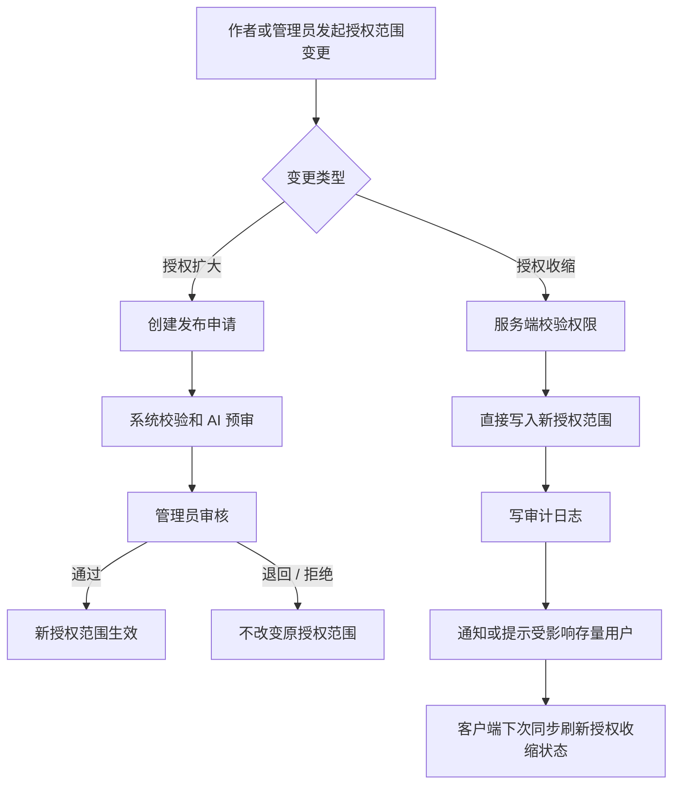
```mermaid
flowchart TD
    A[作者或管理员发起授权范围变更] --> B{变更类型}
    B -->|授权扩大| C[创建发布申请]
    C --> D[系统校验和 AI 预审]
    D --> E[管理员审核]
    E -->|通过| F[新授权范围生效]
    E -->|退回 / 拒绝| G[不改变原授权范围]

    B -->|授权收缩| H[服务端校验权限]
    H --> I[直接写入新授权范围]
    I --> J[写审计日志]
    J --> K[通知或提示受影响存量用户]
    K --> L[客户端下次同步刷新授权收缩状态]
```

### 授权扩大

1. 以下情况属于授权扩大：本部门可用扩大为本部门及下级部门可用、指定部门新增更多部门、任意部门范围扩大为全员可用等。
2. 授权扩大必须创建发布申请。
3. 授权扩大必须经过系统校验、AI 系统预审和管理员审核。
4. 审核期间原授权范围继续生效。
5. 授权扩大不得由客户端直接生效。

### 授权收缩

1. 发布者或管理员提交授权收缩。
2. 服务端判断为授权收缩。
3. 服务端校验操作人是否为作者、维护人或具备管理权限的管理员。
4. 服务端直接生效并写审计日志。
5. 超出新授权范围的用户不可新增安装、接入、复制配置、新增启用、配置写入、下载或更新。
6. 存量已安装 Skill、已接入 MCP Server、已安装 Plugin 可继续保留当前本地状态，除非扩展被安全下架并被安全策略要求处理。
7. 存量用户不可更新到新版本，除非重新进入授权范围。
8. 授权收缩不禁止存量用户停用、卸载、移除托管配置、清除本地敏感变量或清除 manual-download 本地记录。
9. 客户端下一次同步后刷新授权收缩提示。
10. 服务端不承诺实时阻断离线客户端或目标工具直接加载的本地内容。

---

## 16.16 可见选项变更流程

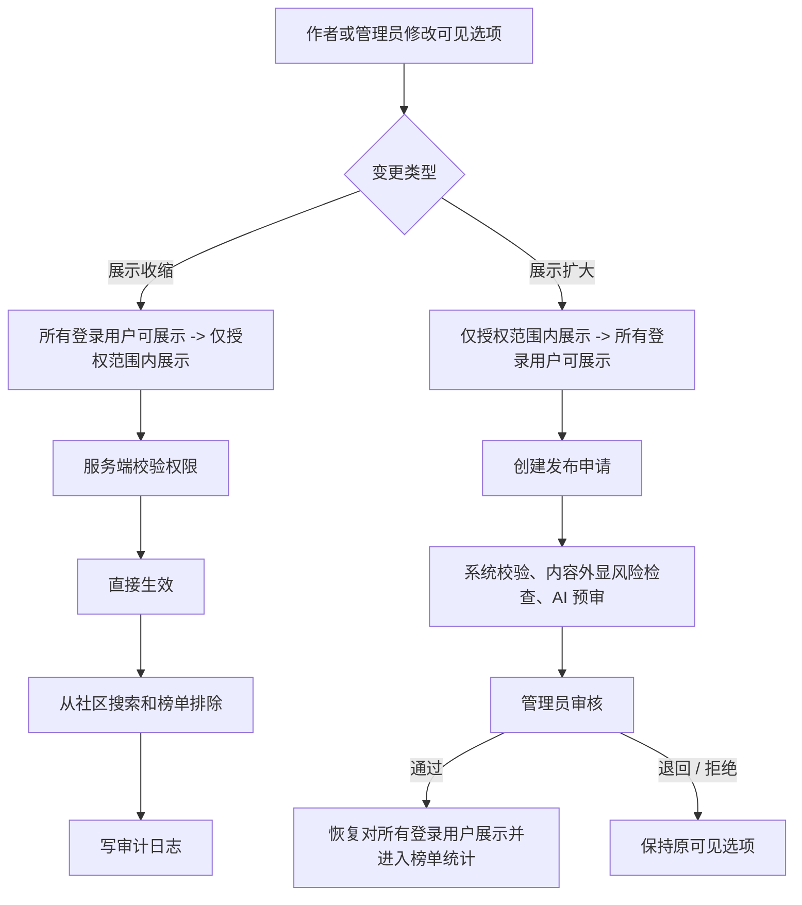
```mermaid
flowchart TD
    A[作者或管理员修改可见选项] --> B{变更类型}
    B -->|展示收缩| C[所有登录用户可展示 -> 仅授权范围内展示]
    C --> D[服务端校验权限]
    D --> E[直接生效]
    E --> F[从社区搜索和榜单排除]
    F --> G[写审计日志]

    B -->|展示扩大| H[仅授权范围内展示 -> 所有登录用户可展示]
    H --> I[创建发布申请]
    I --> J[系统校验、内容外显风险检查、AI 预审]
    J --> K[管理员审核]
    K -->|通过| L[恢复对所有登录用户展示并进入榜单统计]
    K -->|退回 / 拒绝| M[保持原可见选项]
```

### 展示收缩

1. 作者或管理员将扩展改为“仅授权范围内展示”。
2. 服务端判断为展示收缩。
3. 变更直接生效。
4. 扩展从社区榜单统计中移除。
5. 无权限用户不可再搜索或打开详情。
6. 服务端写审计日志。

### 展示扩大

1. 作者或管理员将扩展从“仅授权范围内展示”改为“所有登录用户可展示”。
2. 服务端判断为展示扩大。
3. 系统创建发布申请并进入系统校验、内容外显风险检查、AI 预审和管理员审核流程。
4. 审核通过后，扩展恢复对所有登录用户展示并可进入榜单统计。
5. 服务端写审计日志。

---

## 16.17 普通下架与安全下架流程

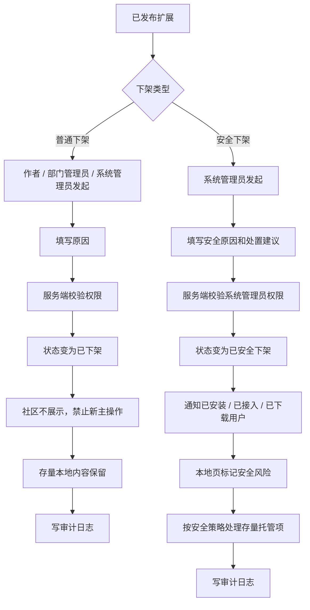
```mermaid
flowchart TD
    A[已发布扩展] --> B{下架类型}
    B -->|普通下架| C[作者 / 部门管理员 / 系统管理员发起]
    C --> D[填写原因]
    D --> E[服务端校验权限]
    E --> F[状态变为已下架]
    F --> G[社区不展示，禁止新主操作]
    G --> H[存量本地内容保留]
    H --> I[写审计日志]

    B -->|安全下架| J[系统管理员发起]
    J --> K[填写安全原因和处置建议]
    K --> L[服务端校验系统管理员权限]
    L --> M[状态变为已安全下架]
    M --> N[通知已安装 / 已接入 / 已下载用户]
    N --> O[本地页标记安全风险]
    O --> P[按安全策略处理存量托管项]
    P --> Q[写审计日志]
```

### 普通下架

1. 发布者、部门管理员或系统管理员点击下架。
2. 系统展示影响说明。
3. 操作人选择普通下架原因并填写说明。
4. 操作人确认。
5. 服务端校验权限。
6. 扩展状态变为已下架。
7. 社区不再展示。
8. 不再允许新安装、接入、复制配置、下载或更新。
9. 服务端写审计日志。
10. 已安装用户不自动删除本地副本或配置。

### 安全下架

1. 系统管理员点击安全下架。
2. 系统展示安全影响说明。
3. 系统管理员填写安全原因和处置建议。
4. 服务端校验系统管理员权限。
5. 扩展状态变为已安全下架。
6. 社区不再展示。
7. 不再允许新安装、接入、复制配置、下载或更新。
8. 已安装、已接入或已下载用户收到强提醒。
9. 本地页标记安全风险。
10. 客户端按系统安全策略执行存量处置：仅提醒、阻止新增启用/接入或强制停用托管项。
11. 强制停用只能处理 Enterprise Agent Hub 托管的 Skill 启用、MCP 配置项或 Plugin 配置。
12. 对目标工具已经直接加载或客户端离线期间运行的内容，系统只能在客户端下一次启动、在线同步且具备本地权限时处理，不能承诺立即阻断。
13. 服务端写审计日志。

---

## 16.18 重新上架流程

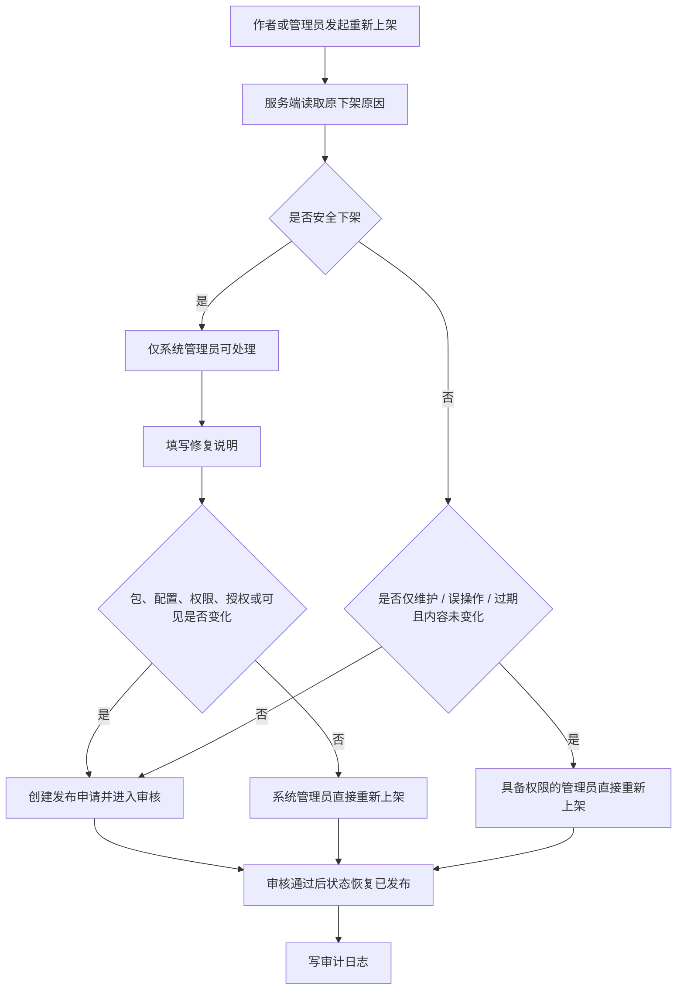
```mermaid
flowchart TD
    A[作者或管理员发起重新上架] --> B[服务端读取原下架原因]
    B --> C{是否安全下架}
    C -->|是| D[仅系统管理员可处理]
    D --> E[填写修复说明]
    E --> F{包、配置、权限、授权或可见是否变化}
    F -->|是| G[创建发布申请并进入审核]
    F -->|否| H[系统管理员直接重新上架]

    C -->|否| I{是否仅维护 / 误操作 / 过期且内容未变化}
    I -->|是| J[具备权限的管理员直接重新上架]
    I -->|否| G
    G --> K[审核通过后状态恢复已发布]
    H --> K
    J --> K
    K --> L[写审计日志]
```

1. 作者或管理员发起重新上架。
2. 服务端读取原下架原因。
3. 若为维护、误操作、过期等非安全原因，且版本、包、元信息、授权范围、可见选项未变化，具备权限的管理员可直接重新上架。
4. 若涉及新版本、元信息修改、授权扩大或展示扩大，系统创建发布申请并进入审核。
5. 若原下架原因为安全风险，必须由系统管理员处理。
6. 安全风险重新上架必须提供修复说明。
7. 包内容、MCP 配置、Plugin 安装清单、权限声明、授权范围或可见选项变化时必须提交审核。
8. 服务端写审计日志。
9. 重新上架后扩展恢复社区展示。
10. 安装、下载、复制配置、配置写入、新增启用和更新仍按授权范围与可见选项控制。
11. 停用、卸载和本地清理不受当前授权范围限制。

---

## 16.19 归档流程

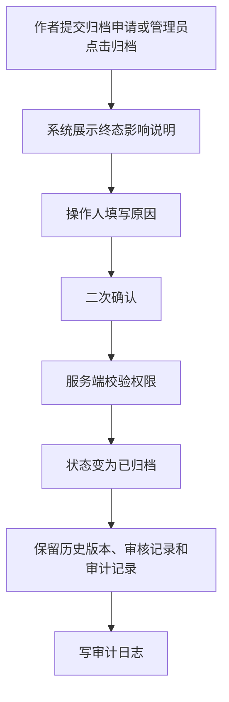
```mermaid
flowchart TD
    A[作者提交归档申请或管理员点击归档] --> B[系统展示终态影响说明]
    B --> C[操作人填写原因]
    C --> D[二次确认]
    D --> E[服务端校验权限]
    E --> F[状态变为已归档]
    F --> G[保留历史版本、审核记录和审计记录]
    G --> H[写审计日志]
```

1. 作者提交归档申请，或管理员在扩展管理中点击归档。
2. 系统展示终态影响说明。
3. 操作人填写原因并二次确认。
4. 服务端校验权限。
5. 扩展状态变为已归档。
6. 服务端写审计日志。
7. 已归档扩展不得重新上架。
8. 已归档扩展不得发布新版本。
9. 已归档扩展不得变更授权范围或可见选项。
10. 已归档扩展的 Extension ID 永久保留，不得被新扩展复用。

---

## 16.20 扩展维护人或归属部门转移流程

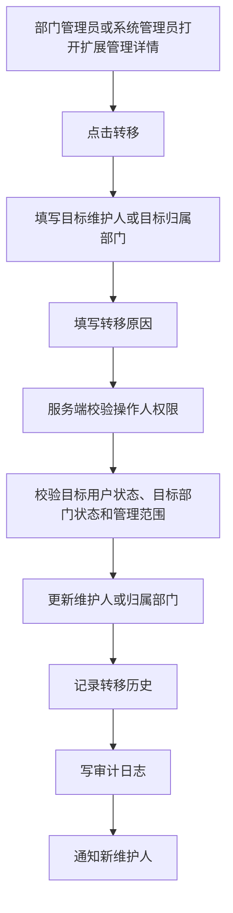
```mermaid
flowchart TD
    A[部门管理员或系统管理员打开扩展管理详情] --> B[点击转移]
    B --> C[填写目标维护人或目标归属部门]
    C --> D[填写转移原因]
    D --> E[服务端校验操作人权限]
    E --> F[校验目标用户状态、目标部门状态和管理范围]
    F --> G[更新维护人或归属部门]
    G --> H[记录转移历史]
    H --> I[写审计日志]
    I --> J[通知新维护人]
```

1. 部门管理员或系统管理员在扩展管理详情中点击转移。
2. 系统展示当前维护人、当前归属部门、目标维护人、目标归属部门和影响说明。
3. 操作人填写转移原因。
4. 服务端校验操作人权限、目标用户状态、目标部门状态和管理范围。
5. 服务端更新扩展维护人或归属部门。
6. 历史作者、历史所属部门、历史审核和审计快照不变。
7. 后续治理权限、通知接收人和管理端归属过滤按新的维护人或归属部门计算。
8. 服务端写审计日志并通知新维护人。

---

## 16.21 部门与用户管理流程

```mermaid
flowchart TD
    A[管理员进入部门与用户] --> B{操作对象}
    B -->|部门| C[新增 / 修改 / 停用 / 恢复 / 删除]
    C --> D[服务端校验管理范围和阻塞条件]
    D --> E[生效部门变更]
    E --> F[必要时失效用户会话和扩展可用性]
    F --> G[写审计日志]

    B -->|用户| H[新增 / 修改 / 冻结 / 解冻 / 删除 / 重置密码 / 角色变更]
    H --> I[服务端校验管理范围、角色边界和最后系统管理员保护]
    I --> J[生效用户变更]
    J --> K[必要时失效目标用户会话]
    K --> G

    B -->|批量导入| L[上传导入数据]
    L --> M[预校验成功数和失败原因]
    M --> N{是否确认导入}
    N -->|是| O[写入新增用户]
    N -->|否| P[不写入]
    O --> G
```

1. 部门与用户是 Web 管理端一级入口，内部拆成组织结构和用户账号两个任务型子页。
2. 部门管理员只能管理自己部门及下级部门普通用户、下级部门管理员和下级部门。
3. 部门管理员不得管理系统管理员、同级管理员、上级管理员、横向部门管理员或管理范围外用户。
4. 系统管理员可全局管理用户和部门，但不得删除或冻结最后一个可用系统管理员。
5. 停用部门后，该部门用户不可登录，已有会话必须失效。
6. 停用部门后，归属部门为该部门的活跃扩展在社区视为失效，不再展示，不允许新安装、接入、复制配置、下载或更新。
7. 删除部门前必须满足：部门下没有用户、没有下级部门、没有活跃扩展归属、没有待审核申请。
8. 新增用户时手机号必须唯一，但技术主键必须使用不可变 userID。
9. 修改用户部门、修改用户角色、冻结用户、删除用户、重置密码后，目标用户已有会话必须失效。
10. 批量导入必须先预校验，展示成功数量、失败数量和失败原因；不得直接写入。
11. 批量导入不用于批量修改既有用户角色。
12. 部门和用户管理写操作必须写审计日志。

---

## 16.22 审计查询与排障流程

```mermaid
flowchart TD
    A[管理员进入审计日志] --> B[输入筛选条件]
    B --> C[服务端按管理员数据范围过滤]
    C --> D[返回审计列表]
    D --> E[打开审计详情]
    E --> F[查看操作人、对象、动作、结果、原因、变更摘要]
    F --> G[复制 requestID]
    G --> H[关联运行日志、本地事件、设备事件或客户端更新事件]
```

1. 管理员进入审计日志。
2. 输入用户、对象、动作、时间、设备 ID 或 requestID。
3. 服务端按管理员管理范围返回结果。
4. 部门管理员只能查看管理范围内审计和自己执行的操作审计。
5. 系统管理员可查看全局审计。
6. 管理员打开详情查看操作人快照、对象快照、动作、结果、原因、变更前后摘要。
7. 审计详情可跳转到相关用户、部门、扩展、申请、客户端设备或客户端更新记录。
8. 管理员可复制 requestID 排查运行日志。
9. 审计日志导出必须遵守管理员数据范围，并写导出审计。
10. 审计日志不得记录密码、Token、API Key、真实密钥、下载凭证明文或敏感变量明文。

---

## 16.23 通知流程

```mermaid
flowchart TD
    A[业务动作发生] --> B{通知类型}
    B -->|发布申请待审核| C[通知审核管理员]
    B -->|审核结果| D[通知发布者]
    B -->|安全下架| E[通知已安装 / 已接入 / 已下载用户]
    B -->|客户端更新| F[通知符合条件客户端]
    C --> G[写 outbox 事件]
    D --> G
    E --> G
    F --> G
    G --> H[通知消费者投递]
    H --> I[用户查看未读通知]
    I --> J[跳转到申请、扩展、设备或更新详情]
```

1. 发布申请进入待审核后，系统通知对应审核管理员。
2. 审核通过、退回修改或拒绝后，系统通知发布者。
3. 安全下架后，系统通知已安装、已接入或已下载用户。
4. 客户端更新发布后，符合更新策略的客户端可收到更新提示。
5. 通知建议通过 outbox 写入，由消费者异步投递，避免影响主事务响应。
6. 通知必须包含对象类型、对象 ID、标题、摘要和跳转信息。
7. 通知内容不得包含敏感明文。

---

## 16.24 客户端设备登记与设备事件流程

```mermaid
flowchart TD
    A[桌面客户端首次启动] --> B[生成 deviceID]
    B --> C[用户登录成功]
    C --> D[客户端向服务端登记设备]
    D --> E[服务端记录用户、部门、设备、版本、OS、架构]
    E --> F[客户端定期上报心跳和版本摘要]
    F --> G[服务端更新最后在线时间和版本分布]
    G --> H[关键异常关联 deviceID]
```

1. 桌面客户端首次启动时生成 deviceID。
2. 用户登录成功后，客户端向服务端登记设备。
3. 服务端记录用户、部门、设备 ID、客户端版本、OS、架构和首次登记时间。
4. 客户端定期上报心跳和版本摘要。
5. 服务端更新最后在线时间和版本分布。
6. 更新失败、本地事件异常、签名校验失败、Hash 校验失败等关键事件可关联到设备 ID。
7. 心跳类事件进入设备事件表，不强制进入审计日志。
8. 更新失败、签名校验失败、Hash 校验失败必须进入审计日志。
9. 主机名只保存摘要或按企业策略脱敏保存。

---

## 16.25 客户端更新流程

```mermaid
flowchart TD
    A[系统管理员创建客户端更新版本] --> B[上传或登记 Windows x64 安装包]
    B --> C[服务端校验版本号、Hash、签名状态和包大小]
    C --> D{是否通过}
    D -->|否| E[禁止发布并返回原因]
    D -->|是| F[系统管理员发布更新]
    F --> G[桌面客户端启动或登录时检查更新]
    G --> H[服务端按设备、版本、渠道和策略返回更新]
    H --> I[用户申请更新包下载凭证]
    I --> J[客户端下载并校验 SHA-256]
    J --> K{Hash 是否通过}
    K -->|否| L[不上线安装程序，记录失败事件]
    K -->|是| M[客户端校验安装包签名]
    M --> N{签名是否通过}
    N -->|否| L
    N -->|是| O[用户确认并启动安装程序]
    O --> P[更新事件上报服务端]
    P --> Q[更新后首次启动上报新版本]
```

1. 系统管理员在 Web 管理端创建客户端更新版本。
2. 上传或登记 Windows x64 安装包。
3. 服务端校验版本号、Hash、签名状态和包大小。
4. 系统管理员发布更新。
5. 桌面客户端登录或启动时检查更新，并携带 deviceID 和当前版本。
6. 若有更新，通知用户。
7. 用户申请下载凭证。
8. 服务端校验设备归属、更新版本状态、签名状态和下载策略。
9. 客户端下载并校验安装包 Hash。
10. 客户端校验安装包签名。
11. Hash 和签名均通过后，用户确认并启动安装程序。
12. Hash 或签名校验失败时不得启动安装程序。
13. 更新事件上报服务端并关联设备 ID。
14. 更新后首次启动时上报新版本。
15. 发布、暂停、撤回客户端更新必须写审计日志。

---

## 16.26 系统设置与 AI 系统预审配置流程

```mermaid
flowchart TD
    A[系统管理员进入系统设置] --> B[修改设置项]
    B --> C[服务端校验系统管理员权限]
    C --> D[校验设置值合法性]
    D --> E{是否通过}
    E -->|否| F[返回明确错误]
    E -->|是| G[保存设置]
    G --> H[写审计日志]
    H --> I[运行时配置生效]
```

1. 系统设置仅系统管理员可访问。
2. 设置项包括企业服务名称、分类列表、标签列表、密码策略、会话策略、上传限制、审计保留天数、客户端更新策略、MCP 配置写入策略、Plugin 受控安装策略、安全下架后存量使用策略、登录失败锁定策略、管理端会话超时策略、AI 系统预审配置等。
3. 修改设置前服务端必须校验系统管理员权限。
4. 修改设置时必须校验设置值合法性。
5. 所有系统设置变更必须写审计日志，记录变更前后摘要。
6. AI 服务必须是企业内网地址，不允许运行时调用互联网 AI 服务。
7. AI 系统预审只用于辅助风险识别，不得自动通过或自动拒绝。
8. AI 系统预审配置变更必须写审计日志。
9. AI 预审不可用时，系统按设置继续人工审核或标记“预审不可用”。

---

## 16.27 权限拒绝、异常与幂等处理流程

```mermaid
flowchart TD
    A[用户或客户端发起请求] --> B[服务端校验身份、状态、权限、对象状态和幂等键]
    B --> C{是否通过}
    C -->|是| D[执行业务]
    D --> E[返回成功结果]
    E --> F[按规则写审计或事件]
    C -->|否| G[返回明确错误码和错误信息]
    G --> H{是否关键动作}
    H -->|是| I[写权限拒绝或异常审计]
    H -->|否| J[记录普通错误日志]
```

1. 服务端所有写操作和主操作必须重新校验当前用户状态、部门状态、角色、管理范围、扩展状态、版本状态、授权范围和可见选项。
2. 前端展示的可操作状态只作为提示，不作为最终授权依据。
3. 权限拒绝、不可见访问拒绝、下载凭证发放失败、Hash 校验失败、本地安装失败、MCP 配置写入失败、Plugin 安装失败、客户端更新失败等关键事件必须可追踪。
4. 幂等操作必须使用幂等键或业务唯一键，避免重复提交、重复审核、重复下载统计或重复本地事件统计。
5. 发布申请的 revision 不得覆盖历史 revision。
6. 审核决定提交时必须校验当前 submission 状态和 current revision，避免重复通过或重复拒绝。
7. 下载凭证只能使用一次，重放或过期必须拒绝。
8. 本地事件同步必须按 deviceID 和 idempotencyKey 去重。
9. 批量导入必须先预校验，确认后写入，失败行不得被静默忽略。
10. 系统不得在失败后返回默认成功、空集合、空对象或假状态。

---

## 16.28 流程验收关注点

1. Skill、MCP Server、Plugin 均可完成发布、系统预审、管理员审核、入库、展示、安装或接入、更新、卸载、统计和审计闭环。
2. 发布流程必须先形成 submission 和 revision，再绑定包快照、规则预审、AI 系统预审和审核记录。
3. 管理员审核通过后，Extension、Version、授权范围、可见选项、MCP 定义、Plugin 定义和包引用必须在同一业务事务中保持一致。
4. 退回修改必须保留历史 revision，不得覆盖原提交内容和原预审结果。
5. 授权扩大和展示扩大必须进入审核；授权收缩和展示收缩可直接生效但必须审计。
6. 普通下架不删除存量本地内容；安全下架必须通知存量用户并按安全策略处理托管项。
7. 归档为终态，Extension ID 不得复用。
8. 本地写入必须有执行计划、备份、失败反馈和尽量回滚，不得只显示乐观成功。
9. 离线期间不得执行依赖服务端授权的新操作。
10. 审计日志必须覆盖发布、预审、审核、下载凭证、权限拒绝、扩展治理、用户部门管理、客户端更新和系统设置变更。
